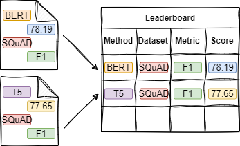

# 🏆 Automatic Scientific Leaderboard Generation Reading List

This repository corresponds to the paper:  
**A Position Paper on the Automatic Generation of Machine Learning Leaderboards**  

  
*Figure 1: A conceptual diagram illustrating the flow of information extraction from scientific papers to generate leaderboards.*

This curated list contains research papers and resources that explore various methods for extracting leaderboard tuples from scientific literature. The collection will be continually updated to support the ongoing leaderboard survey paper.  

---

## 📚 Research Papers

- 📝 **Hou et al. (2019)**  
  _Identification of tasks, datasets, evaluation metrics, and numeric scores for scientific leaderboard construction._  
  🔗 [Read the Paper](https://doi.org/10.18653/v1/P19-1342)

- 📝 **Singh et al. (2019)**  
  _Automated early leaderboard generation from comparative tables._  
  🔗 [Read the Paper](https://doi.org/10.1007/978-3-030-15712-8_17)

- 📝 **Kardas et al. (2020)**  
  _AxCell: Automatic extraction of results from machine learning papers._  
  🔗 [Read the Paper](https://doi.org/10.18653/v1/2020.emnlp-main.581)

- 📝 **Jain et al. (2020)**  
  _SciREX: A challenge dataset for document-level information extraction._  
  🔗 [Read the Paper](https://doi.org/10.18653/v1/2020.emnlp-main.294)

- 📝 **Kabongo et al. (2021)**  
  _Automated mining of leaderboards for empirical AI research._  
  🔗 [Read the Paper](https://doi.org/10.1007/978-3-030-80624-8_23)

- 📝 **Yang et al. (2022)**  
  _TELIN: Table entity linker for extracting leaderboards from machine learning publications._  
  🔗 [Read the Paper](https://doi.org/10.18653/v1/2022.emnlp-main.277)

- 📝 **Kabongo et al. (2023)**  
  _ORKG-Leaderboards: A systematic workflow for mining leaderboards as a knowledge graph._  
  🔗 [Read the Paper](https://doi.org/10.1007/s00799-023-00331-7)

- 📝 **Kabongo et al. (2024)**  
  _Effective context selection in LLM-based leaderboard generation: An empirical study._  
  🔗 [Read the Paper](https://arxiv.org/abs/2407.02409)

- 📝 **Singh et al. (2024)**  
  _LegoBench: Scientific leaderboard generation benchmark._  
  🔗 [Read the Paper](https://aclanthology.org/2024.findings-emnlp.855/)

- 📝 **Şahinuç et al. (2024)**  
  _Efficient performance tracking: Leveraging large language models for automated construction of scientific leaderboards._  
  🔗 [Read the Paper](https://aclanthology.org/2024.emnlp-main.453/)

---

## 🔧 Methodologies for Extracting Leaderboard Tuples

| 📰 **Paper**                           | 🔍 **Method** | 🔥 **LLMP** | 👥 **HIL** | 🔗 **CR** | 📄 **Doc-TAET** | 🧾 **Doc-REC** | 📑 **Full Paper** | 📊 **Tab** | 🧠 **NLP Models** |
|---------------------------------------|--------------|------------|-----------|-----------|----------------|----------------|------------------|-------------|------------------|
| Hou et al. (2019)                     | TDMS-IE      | ✗          | ✗         | ✗         | ✓              |                |                  |             | BERT             |
| Singh et al. (2019)                   | PIG          | ✗          | ✗         | ✗         |                |                |                  | ✓           | N/A              |
| Kardas et al. (2020)                  | AXCELL       | ✗          | ✗         | ✗         |                |                | ∧                | ∧           | ULMFiT, BM25      |
| Jain et al. (2020)                    | SCIREX-IE    | ✗          | ✗         | ✓         |                |                | ✓                |             | SciBERT ∨ BiLSTM |
| Kabongo et al. (2021)                 | ORKG-TDM     | ✗          | ✗         | ✗         | ✓              |                |                  |             | XLNet ∨ SciBERT ∨ BERTbase |
| Yang et al. (2022)                    | TELIN        | ✗          | ✓         | ✗         |                |                | ∧                | ∧           |                  |
| Kabongo et al. (2023)                 | ORKG-LB      | ✗          | ✗         | ✗         | ✓              |                |                  |             | BERT ∨ SciBERT ∨ XLNet ∨ BigBERT |
| Kabongo et al. (2024)                 | TDMS-PR      | ✓          | ✗         | ✗         | ∨              | ∨              | ∨                |             | Llama 2 ∨ Mistral |
| Singh et al. (2024)                   | MS-PR        | ✓          | ✗         | ✗         |                |                | ✓                |             | Falcon ∨ Galactica ∨ Llama ∨ Mistral ∨ Vicuna ∨ Sephyr ∨ Gemini ∨ GPT-4 |
| Şahinuç et al. (2024)                 | TDMR-PR      | ✓          | ✗         | ✗         | ✗              | ✗              | ✓                |             | Llama 2 ∨ Llama 3 ∨ Mixtral ∨ GPT-4 |

---

## 📈 Assumptions and Preliminaries for Extracting Leaderboard Tuples

| 🔍 **Method** | 📑 **Paper**            | 🌍 **Open Domain** | 🛠 **Works w/o Tables** | 📊 **Extract all Results** |
|---------------|------------------------|--------------------|------------------------|----------------------------|
| TDMS-IE       | Hou et al. (2019)      | ✗                  | ✓                      | ✗                          |
| PIG           | Singh et al. (2019)    |                    | ✗                      |                            |
| AXCELL        | Kardas et al. (2020)   | ✗                  | ✗                      | ✗                          |
| SCIREX-IE     | Jain et al. (2020)     | ✓                  | ✓                      | -                          |
| ORKG-TDM      | Kabongo et al. (2021)  | ✗                  | ✓                      | -                          |
| TELIN         | Yang et al. (2022)     | ✓                  | ✗                      | ✗                          |
| ORKG-LB       | Kabongo et al. (2023)  | ✗                  | ✓                      | -                          |
| TDMS-LLMP     | Kabongo et al. (2024)  | ✓                  | ✓                      |                            |
| MS-LLMP       | Singh et al. (2024)    | ✓                  | ✓                      |                            |
| TDMR-LLMP     | Şahinuç et al. (2024) | ✓                  | ✓                      | ✗                          |

---

## 🤝 Contributing to the Reading List

To contribute new research papers or make updates:  
1. **Fork** the repository. 🍴  
2. **Create a new branch** with your changes. 🌿  
3. **Submit a pull request** with your additions. ✅  

---

This page serves as an evolving resource to advance research on the automated extraction of leaderboard results. Contributions are encouraged to maintain a comprehensive and up-to-date list. 🎓
